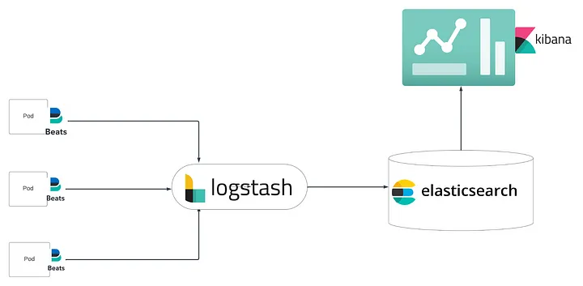

# Elasticsearch on Kubernetes

> Our logging stack will have, Filebeat, Logstash, Elasticsearch and Kibana

Filebeat is a daemon set that collects logs from individual pods and sends them to Logstash, which aggregates, processes, and sends logs to Elasticsearch where they are stored, lastly, we have Kibana where we can visualize our logs.



### Installation

#### Verify your connection to Kubernetes

```bash
export KUBECONFIG=<path>
kubectl auth can-i delete pods
```
Following command will add all the repositories that we need for our Elastic stack

```bash
helm repo add elastic https://helm.elastic.co
```
Creating a separate namespace

```bash
kubectl create ns monitoring
```

We will overwrite the default helm value file to change some configs

#### Elasticsearch

Before deploying elastic patching the storageclass to set it as default.

A common issue when deploying Elasticsearch using a Helm chart is related to PersistentVolumeClaims (PVCs). This typically happens when the PVC cannot find a suitable PersistentVolume (PV) to bind to due to a missing or misconfigured StorageClass.

```bash
kubectl patch storageclass gp2 -p '{"metadata": {"annotations":{"storageclass.kubernetes.io/is-default-class":"true"}}}'
```
```bash
helm install elasticsearch elastic/elasticsearch -f Elasticsearch/elasticsearch_values.yaml -n monitoring
```

#### Filebeat
```bash
helm install filebeat elastic/filebeat -f Filebeat/filebeat_values.yaml -n monitoring
```

#### Logstash
```bash
helm install logstash elastic/logstash -f Logstash/logstash_values.yaml -n monitoring
```

#### Kibana
```bash
helm install kibana elastic/kibana -f Kibana/kibana_values.yaml -n monitoring
```


# Solution Design and Implementation

## 1. **Deployment Method**

### Why Helm?
I chose **Helm** for deploying the Elasticsearch (ES) cluster as part of a comprehensive Elastic Stack (Filebeat, Logstash, Elasticsearch, and Kibana). Here’s why Helm is suitable for this project:
- **Modularity and Reusability**: Helm allows us to manage each component (Filebeat, Logstash, Elasticsearch, Kibana) through individual charts, making the deployment modular. This means configurations can be updated independently without impacting the entire stack.
- **Templating**: Helm’s built-in templating system reduces complexity by allowing us to reuse and customize YAML files with parameters that fit our specific needs.
- **Version Control**: Helm supports versioning, facilitating easier management of updates, rollbacks, and upgrades. This is especially useful when deploying Elasticsearch, where component versions are critical for maintaining stability.
- **Ease of Deployment**: Helm provides a user-friendly method to override default configurations with custom values, using files like `elasticsearch_values.yaml`. This streamlines setup and enhances reproducibility.

## 2. **High Availability and Resiliency**

### Strategies for Elasticsearch
- **Node Replication**: Elasticsearch is configured with multiple nodes (master, data, client) to ensure redundancy. This setup minimizes downtime and allows maintenance without affecting the cluster’s availability.
- **Anti-Affinity Rules**: Kubernetes anti-affinity rules ensure that nodes are distributed across different physical hardware, preventing simultaneous failures due to hardware issues.
- **Data Persistence**: Persistent Volumes are utilized to store Elasticsearch data. PVCs are bound to PersistentVolumes using a specific StorageClass, ensuring data durability even if pods are rescheduled.

### Log Collection with Filebeat
- Filebeat is configured as a **DaemonSet**, meaning each Kubernetes node has a Filebeat instance collecting pod logs. This ensures that no logs are missed during network or node failures.

## 3. **Security Considerations**

### Elasticsearch Security
- **TLS Encryption**: All communication between nodes and clients is encrypted using TLS. This ensures data confidentiality and integrity within the Elasticsearch cluster.
- **RBAC (Role-Based Access Control)**: Implemented using Elasticsearch’s built-in security features to manage user permissions and access rights.
- **Kubernetes Network Policies**: Network policies restrict access to the Elastic components (e.g., Logstash can only communicate with Elasticsearch, not Filebeat).

### Securing the Elastic Stack
- **Secrets Management**: Credentials and sensitive configurations are managed using **Kubernetes Secrets**, which are securely mounted to the pods.
- **Logstash Pipelines**: Configured to sanitize and filter incoming log data, ensuring that sensitive information isn’t accidentally indexed.

## 4. **Operational Considerations**

### Upgrades and Maintenance
- **Rolling Upgrades**: Kubernetes and Helm support rolling updates, ensuring that updates are applied without disrupting the service. This strategy minimizes downtime when upgrading Elasticsearch or other stack components.
- **Resource Scaling**: Elasticsearch node replicas can be scaled horizontally by modifying `elasticsearch_values.yaml` and redeploying. The Horizontal Pod Autoscaler (HPA) can also be used to adjust replicas based on CPU/memory utilization.
- **Monitoring Storage Usage**: Persistent storage sizes can be dynamically adjusted by updating the storage limits in the Helm values file and redeploying with `helm upgrade`.

### Backup and Disaster Recovery
- **Snapshot Management**: Elasticsearch supports snapshots to back up indices. I recommend scheduling automated snapshots using Kibana’s built-in snapshot functionality or a cron job to a secure external storage (e.g., AWS S3).
- **Data Recovery**: In case of a disaster, the snapshots can be restored to recover the Elasticsearch indices.

## 5. **System Observability**

### Key Metrics
- **Cluster Health**: Monitor Elasticsearch cluster status (green, yellow, red), node counts, and shard allocation to detect any problems.
- **Index Performance**: Track indexing rate, search performance, and response times to identify performance bottlenecks.
- **Node Metrics**: Monitor individual node health including CPU usage, memory consumption, and disk I/O.
- **Log Volume**: Filebeat metrics provide visibility into log collection rates and ensure all logs are properly forwarded to Logstash.

### Tools and Dashboards
- **Prometheus and Grafana**: Use Prometheus to collect metrics from Elasticsearch, Logstash, and Kubernetes components, and visualize them using Grafana dashboards.
- **Kibana Dashboards**: Create custom Kibana dashboards to visualize log trends, error rates, and system performance.

## 6. **Future Improvements**

### Scalability Enhancements
- **Auto-Scaling**: Integrate Kubernetes’ **Horizontal Pod Autoscaler (HPA)** for the Filebeat and Logstash deployments to automatically adjust the number of replicas based on load.
- **Elastic APM Integration**: Use Elastic APM for deeper performance monitoring of applications feeding data into Elasticsearch.

### Security Hardening
- **Mutual TLS (mTLS)**: Implement mTLS to further secure inter-service communication within the Elastic stack.
- **Enhanced RBAC**: Expand role-based permissions to support granular access to specific indices or logs.

### Advanced Logging
- **Structured Logging**: Standardize log formats using Logstash pipelines, making logs easier to parse and analyze.
- **Log Aggregation**: Consider integrating a more robust log aggregation solution with **Fluentd** for advanced log routing and processing.

### Operational Automation
- **Helmfile**: Use **Helmfile** to manage multiple Helm charts in a unified manner, allowing easier management of the full stack.
- **GitOps**: Implement a GitOps strategy using tools like **ArgoCD** or **Flux** to automate deployment changes directly from a Git repository.